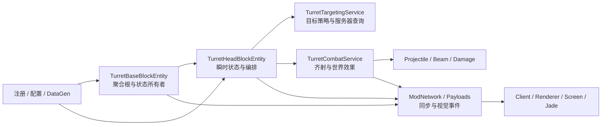
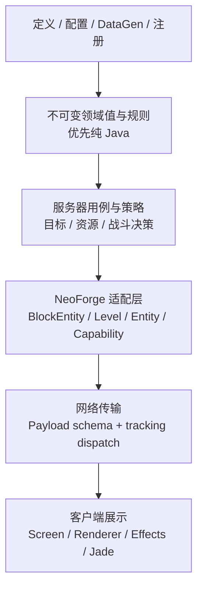

# OMT 模组架构优化方案

状态：`执行中：阶段 0 基线与合同对账`

制定日期：2026-08-07

项目：Minecraft 1.21.1 / NeoForge 21.1.234 / `openmodularturrets`

## 1. 方案目的

本方案的目标不是把每个大类拆成许多小类，也不是用抽象层数量制造“看起来很工程化”的结构，而是让模组达到以下可审计的架构状态：

- 每一份可变状态都有唯一、明确的所有者；
- 领域规则、NeoForge 生命周期、网络传输和客户端展示之间的依赖方向稳定且无环；
- 新增炮塔主要通过定义、规则和注册接入，不需要修改核心炮台循环；
- 服务器权威、主线程所有权、客户端隔离和存档兼容性都有可验证证据；
- 性能优化只在测量证明有收益时实施，不以主观“应该更快”结案；
- 每个结构变化都能单独验证、单独回滚，避免一次性大重写。

这里的“优雅且完美”采用工程上可验收的定义：没有未解释的高风险边界、没有无必要的抽象、没有未经测量的性能承诺，并且所有保留的复杂性都能说明其所有者、原因和验证方式。它不以行数最少或类数量最少为目标。

## 2. 执行边界与前置状态

### 2.1 本方案只处理模组本身

本方案的修改范围仅为模组代码、模组资源、模组测试和项目侧文档。

`.agents/` 是外部工具包，只作为执行门禁和辅助工具使用，不属于本项目的架构优化对象。执行期间不得修改、格式化、重构或迭代 `.agents/`，也不把工具包的状态纳入本方案完成条件。

### 2.2 当前批次的前置事实

上一批架构整理已经完成以下基础工作，后续不得重复拆分或破坏其边界：

- `TurretHeadBlockEntity` 已负责每个炮塔头的瞬时状态和生命周期编排；
- `TurretTargetingService` 已承接目标验证、目标扫描、评分和视线判断；
- `TurretCombatService` 已承接齐射执行、投射物/光束/特殊攻击的服务器侧执行；
- 服务层不持有或回调 `TurretHeadBlockEntity`，避免 `Head → Service → Head` 循环；
- 固定压力场景、旧存档检查入口和 L0/L1/L2/L2.5/L3/L4 门禁已经建立；但合同里的 `test_id` 是语义 ID，不等于源码中一定存在同名字符串，必须在阶段 0 对账到真实 `test_ref`、脚本或门禁命令后，才能把它当作已验证证据；
- 当前正式压力对比以“已优化的当前脏工作区”为基线，而不是旧 `git HEAD`；
- 上一批执行记录 `docs/porting/architecture-refactor-execution.md` 仍为 `verifying`，唯一未收尾事项是一次人工客户端验收。本方案不把它误标为已完成，也不通过反复启动客户端来重复验证。

### 2.3 合同 test_id 与真实执行器的对账原则

当前 `docs/features/architecture_refactor.contract.json` 中的 test ID 应按“合同索引”理解，而不是按源码字面量搜索理解。阶段 0 必须读取合同中的 `test_ref` 和 `command`，逐项确认执行器存在、能够运行，并记录它属于 GameTest、外部检查、性能证据还是人工检查。

当前合同的预期映射如下；执行阶段仍以合同文件的实际内容为准：

| test_id | 真实执行器/证据入口 | 类型 | 阶段 0 必须确认 |
| --- | --- | --- | --- |
| `architecture_behavior_gametest` | `OpenModularTurretsGameTests#potatoTurretAcquiresVisibleHostileAndFires` 及全量 GameTest | GameTest | `test_ref` 方法仍存在且被实际发现/执行 |
| `architecture_state_roundtrip` | `OpenModularTurretsGameTests#statePersistence` | GameTest/迁移 | `test_ref` 方法存在；不能要求源码出现 `architecture_state_roundtrip` 字符串 |
| `architecture_old_save_load` | `tools/architecture_refactor_pressure.ps1 -Mode old-save-check` | 外部旧存档证据 | 脚本、输入存档副本、保存完成标记和 key 对账都存在 |
| `architecture_boundary_static` | `static_gate.py` 及其报告 | 静态/集成 | 命令可运行，报告不是仅有合同声明 |
| `architecture_pressure` | `architecture_refactor_pressure.ps1` 的 baseline/candidate 压测与 JFR | 性能 | 固定场景、样本数量、基线和候选报告完整 |
| `architecture_dedicated_server` | `compile_and_repair.py --with-server` | 专用服务器 | 专服启动、到达完成标记且无客户端类加载 |
| `architecture_asset_contract` | DataGen、静态和 asset gate | 资源 | 生成物和 diff 审查均有记录 |

对账可以先作为项目侧执行记录中的检查清单；如果需要自动化，脚本应放在项目 `tools/`，不得为了此事修改 `.agents/`。对账报告必须区分“合同声明存在”“执行器存在”“本次执行通过”三个状态，防止把合同条目误报成测试证据。

### 2.4 证据和工作区约束

建议本方案执行批次使用仓库外持久目录：

```text
D:\c128\phase25-evidence\architecture-optimization-20260807\
```

该目录保存基线、候选 manifest、压力统计、JFR、旧存档副本、日志摘要和阶段交接文件。`run/`、系统 TEMP 和仓库内生成的临时运行目录不得作为正式证据根目录。

执行时保留现有脏工作区和用户改动，不使用 `git reset --hard`、`git checkout --` 或 `git clean`。每个阶段先记录当前状态和源文件摘要，再做最小补丁。

## 3. 当前架构评估

### 3.1 当前依赖关系



当前结构已经具备“服务器逻辑和客户端展示分开”的基本形态，问题主要是若干类内部仍承担过多不同性质的职责，而不是整体方向错误。

### 3.2 现有组件职责和问题

| 组件 | 当前职责 | 评价 | 后续处理 |
| --- | --- | --- | --- |
| `TurretBaseBlockEntity`（当前检查约 1366 行，阶段 0 重新记录） | 能量、物品栏/能力、附件拓扑、所有权/信任、红石/太阳能/反应堆、目标许可、伪装、菜单、持久化、同步和生命周期 | 是合理的聚合根，但职责面过宽，是当前最大架构债务；行数只是诊断信息，不是验收指标 | 按垂直切片提取规则、解析器和窄端口；不拆散状态所有权和 NBT 所有权 |
| `TurretHeadBlockEntity`（约 362 行） | 炮塔头的冷却、目标 ID、瞄准状态、优先级、基座查找和服务器 Tick 编排 | 当前边界已经较清晰 | 保持编排角色；除非复杂度或性能证据明确，不再机械拆分 |
| `TurretTargetingService` | 目标验证、扫描、评分、视线缓存和目标合法性判断 | 拆分有效；当前同时接收窄状态视图和具体 Base，其中 `isTargetClaimedBySibling`、`mayDamage` 是带世界/权限上下文的服务器查询，不应被误判为纯规则 | 只把范围、模式、优先级、过滤等规则输入快照化；把兄弟认领和伤害许可保留为显式服务器适配查询，不引入巨型 `BasePort` |
| `TurretCombatService` | 特殊攻击、投射物、光束伤害、声音/粒子和 Beam 网络分发 | 运行边界正确，但“规则决定、世界执行、视觉传输”仍混在一起 | 先测量；只有测试性或热点证据明确时再拆成计划/执行/视觉三段 |
| `TurretTargetingWorldQueries` + 标量输入 | 为目标服务提供显式世界查询和最小规则输入 | 方向正确 | 不把只消费 `range` 的服务强行绑定到宽状态视图 |
| `ModNetwork` 与 Payload | 编解码、注册、服务器到客户端的视觉/状态分发 | 协议已有稳定边界 | 保留 Payload ID、字段顺序和编码；只整理发送入口和接收端职责 |
| `client` 侧 | 屏幕、渲染、粒子、投射物视觉缓存和客户端事件 | 整体隔离良好；当前 common/server 审计仍发现 `OmtTooltips` 中一处受短路保护的惰性 `Screen` 引用，`ModNetwork` 未发现同类残留 | 阶段 0 重新审计；若该处仍存在，做一次针对性 client bridge 清理；若已由其他改动消失，则只保留静态断言，不做重复迁移 |
| Jade 兼容 | Provider 提供通用数据，客户端注册在客户端侧触发 | 当前没有发现服务端类加载崩溃证据 | 保持 Provider 无客户端依赖；只改善物理包边界和回归测试 |

### 3.3 当前未发现的高风险问题

截至本方案制定时，没有证据表明当前架构存在必须立即修复的服务端崩溃、网络协议损坏或存档 key 漂移。现有检查还显示：

- 没有发现 `broadcastAll` 形式的无范围广播；
- 当前服务层没有反向持有 Head；
- 现有压力场景的候选 p95 相对基线增量在既定预算内；
- 上一批报告中的 GameTest 已全绿，但测试数量不在本方案中冻结；每次以最新 `gametest-gate.json` 的发现数和通过数为准；
- 专用服务器启动和旧存档保存/加载闭环已有独立执行入口和报告，但仍须按 2.3 的合同 ID 对账确认覆盖关系；
- Base 已存在附件拓扑、范围和容量缓存：`cachedAmmoExpanderPositions`/`ammoTopologyCached`、`cachedRangeLevel`/`cachedRangeGameTime`/`cachedRangeUpgradeLevel`、`cachedCapacityLevel`/`cachedCapacityGameTime`；已知失效路径包括 `TurretBaseBlock.neighborChanged → invalidateNeighborCaches` 和升级槽 `onContentsChanged`。`blockEntityIn`、`setRemoved`、加载/卸载等生命周期覆盖是否需要补充，必须在阶段 0 实查，不能假定完整或从零重做；
- Base 当前已经区分 `markForSave()`、`markForSaveAndSync()` 和 `ModNetwork.sendBlockEntityUpdateToTracking(...)` 三条语义不同的路径；后续能量切片继承这条边界，不把同步再次包装成重复抽象。

这些事实说明后续工作是“收紧边界和降低维护风险”，不是证明当前代码已经不可用。

## 4. 目标架构

### 4.1 目标分层和依赖方向



依赖方向的硬规则如下：

- `client` 不被 common/server 代码引用；
- 纯规则和不可变值不依赖 `Level`、实体实例或客户端类；确有查询需要时，通过窄端口进入服务器适配层；
- 目标选择中的世界/权限查询保持在服务器适配层；当前 `isTargetClaimedBySibling(...)` 和 `mayDamage(...)` 涉及兄弟炮塔、玩家/队伍和世界状态，不强行伪装成纯 Java 规则；
- 服务不依赖 `TurretHeadBlockEntity`，也不通过回调修改调用者；
- `TurretBaseBlockEntity` 仍是基座聚合根和持久化状态唯一所有者；
- `TurretHeadBlockEntity` 只拥有炮塔头自己的瞬时/持久状态，并编排服务调用；
- 网络层拥有 Payload schema 和发送范围，业务服务不直接决定客户端如何渲染；
- 不建立跨平台接口、通用 DI 容器或“万能平台助手”，因为当前项目是单 NeoForge 平台。

### 4.2 状态所有权模型

| 状态 | 唯一所有者 | 允许的读取方式 | 允许的修改方式 |
| --- | --- | --- | --- |
| 基座能量、库存、附件、所有权、配置和统计 | `TurretBaseBlockEntity` | 窄只读视图或能力端口 | 由 Base 在服务器主线程内修改；服务只能通过明确资源端口申请 |
| 炮塔头冷却、目标 ID、瞄准和优先级 | `TurretHeadBlockEntity` | Head 只读快照或方法参数 | 由 Head 生命周期在服务器主线程内修改 |
| 目标扫描/视线短缓存 | 对应目标服务实例 | 服务内部 | 服务内部，且必须有失效周期 |
| 客户端投射物/Beam 缓存 | 客户端事件/渲染缓存 | 客户端 | 只由客户端事件链更新；服务端不持有客户端缓存 |
| 存档序列化格式 | 对应 BlockEntity 的 `saveAdditional/loadAdditional` 边界 | 迁移/测试工具只读 | 只有明确批准的兼容迁移才能改变；本方案默认不改 key |
| Payload 字段和编码 | `ModNetwork`/Payload 类型 | 网络注册和测试读取 | 只有协议变更合同批准后才能改变；本方案不改变 |

### 4.3 Base 的正确拆法

`TurretBaseBlockEntity` 不应被简单拆成“多个对象各自持有一部分字段”。正确目标是：Base 继续持有状态和持久化边界，只把纯策略、查找算法、缓存决策和窄能力端口提取出去。

候选边界如下，名称可以在执行阶段根据现有 API 微调：

| 候选边界 | 应该拥有的内容 | 不应该拥有的内容 |
| --- | --- | --- |
| `TurretAccessPolicy` / 所有权规则 | 全局信任、本地信任、队伍/玩家判断、目标许可的纯规则 | 玩家状态写入、世界查找、NBT 读写 |
| `TurretAttachmentResolver` | 如果阶段 0 发现确有独立收益，可承接附件拓扑探测、缓存键和缓存失效策略 | 代替 Base 持有附件状态或修改库存；不得重复创建当前已有的拓扑/范围/容量缓存 |
| `TurretResourcePort` / 资源策略 | “本次攻击是否能消耗资源”“扣除多少”的窄接口和规则 | 独立复制能量字段、改变能量消耗数值 |
| `TurretVisualState` / 同步策略（可选） | 只有发现现有同步边界无法表达时，才判断哪些状态变化需要追踪同步 | 重新包装已有 `markForSave`、`markForSaveAndSync`、定向追踪更新，或直接改变 Payload schema/每 Tick 广播 |
| 持久化辅助函数（仅必要时） | 对固定 key 的读写映射和兼容读取 | 让多个类共同决定同一份 NBT 状态 |

每次提取前必须回答：

1. 新类是否有唯一的状态/规则所有者？
2. 新类是否可以通过窄输入输出测试，而不是必须构造完整世界？
3. 是否减少了依赖方向或重复计算，而不仅是移动了代码行？
4. 若新类删除，是否能在一个回滚点恢复原行为？

如果其中任一答案为否，则暂不提取。

## 5. 分阶段实施计划

阶段严格按依赖顺序推进。每个阶段结束后必须先得到证据，再进入下一阶段；不在一个阶段中同时移动 NBT、网络协议和玩法规则。

### 阶段 0：基线、依赖图和不变量冻结

**目标**：把“优雅”和“不回归”转化为可检查的合同，先建立当前已优化代码的基线。

**工作内容**：

- 记录当前工作区 manifest、Java 文件摘要、注册 ID、配置键、Payload ID/字段顺序；
- 读取当前 Major 合同，按 `test_ref`/`command` 对账每个 `test_id`；确认 `architecture_state_roundtrip` 对应真实 `statePersistence` 方法，`architecture_old_save_load` 对应外部旧存档脚本，并把“声明/执行器/本次通过”分开记录；
- 从 `TurretBaseBlockEntity`、`TurretHeadBlockEntity`、`TurretProjectileEntity` 的 `saveAdditional/loadAdditional` 建立逐 key 账本；
- 记录服务层的入参、出参和依赖方向，形成架构依赖图；
- 清点 Base 现有缓存键和失效链：附件拓扑、范围、容量，以及 `neighborChanged`、升级槽 `onContentsChanged`、BlockEntity 加载/卸载和移除路径；只有发现明确缺口才提出修复或提取；
- 对 common/server Java 做客户端引用审计；当前已知 `OmtTooltips` 仍有一处受短路保护的 `Screen` 引用，需确认是否仍在工作区，不能把上一批 `ModNetwork` 清理结果扩大解释为全树零引用；
- 把 `markForSave()`、`markForSaveAndSync()`、`sendBlockEntityUpdateToTracking(...)` 的调用点和语义写入同步账本；阶段 2C 不重新设计这三条路径；
- 用当前压力场景在同一机器、同一 JVM/配置下运行至少三次 baseline；
- 记录服务器 tick p50/p95/p99、JFR attach 状态和 OMT 栈采样；
- 增加或启用可关闭的同步/包计数观测，不改变默认行为；
- 将当前手工客户端验收列为待办，不在阶段 0 反复启动客户端。

**完成条件**：

- baseline 三次均完成固定场景，样本数量一致；
- 每个合同 `test_id` 都已解析到真实方法、脚本或门禁命令；若 `test_ref` 方法不存在或命令没有可执行证据，阶段 0 失败；
- NBT、注册、配置和 Payload 账本可以逐项对账；
- 缓存失效、同步路径和客户端引用审计结果已记录，且没有把待核对项写成已通过；
- 依赖图中所有已知跨层依赖都有解释；
- 未引入代码行为变化。

**回滚点**：删除阶段 0 新增的观测/文档/manifest；不触碰既有模组状态。

### 阶段 1：建立窄上下文和端口，不搬持久化状态

**目标**：让服务依赖“它需要的能力”，而不是依赖完整的 `TurretBaseBlockEntity`。

**工作内容**：

- 审查目标服务的每个状态输入；只传递实际消费的标量（当前为 `range`），把玩家/队伍/安全数据查询保留为显式服务器适配器；
- 为目标服务准备只读目标上下文，至少包含位置、范围、模式、优先级和过滤规则所需的稳定值；不要把 `isTargetClaimedBySibling(...)`、`mayDamage(...)` 这类需要世界/权限上下文的查询强行塞进纯快照；
- 为战斗服务准备资源端口/结果对象，使服务不直接操作 Base 内部字段；
- 用不可变快照传递规则输入；服务不得缓存世界对象或持有 Head；
- 暂不移动任何 `saveAdditional/loadAdditional` 字段，不修改 NBT key、Payload 和配置默认值。

**完成条件**：

- 纯规则输入依赖窄接口/不可变快照；世界查询依赖明确的服务器适配参数，不以“全都纯化”为验收目标；
- 没有新增 `Base → Head`、`Service → Head` 或服务间循环；
- 目标选择、资源消耗和攻击结果与基线一致；
- L0/L1/L2 通过，相关 GameTest 全绿，旧存档加载/保存对账通过。

**回滚点**：恢复原服务签名，保留阶段 0 的账本和测试；不得留下半套端口层。

### 阶段 2：按垂直切片降低 Base 的职责耦合

阶段 2 是本方案的主要实施风险，必须一个切片一个回滚点。不得按“把每 200 行挪出去”机械执行。

#### 2A：所有权、信任和目标许可

- 提取纯权限/信任判断；
- Base 继续提供玩家、队伍、配置和世界上下文；
- 明确 `owner`、`owner_name`、`owner_team`、本地信任等字段的唯一读写路径；
- 对攻击玩家、敌对/中立目标、兄弟炮塔占用等行为做逐项测试。

#### 2B：复核既有附件拓扑、范围和容量缓存

这一切片不是从零建立缓存体系。阶段 0 已确认当前 Base 已有：

- `cachedAmmoExpanderPositions`、`ammoTopologyCached` 和 `cachedAmmoInventories`；
- `cachedRangeLevel`、`cachedRangeGameTime`、`cachedRangeUpgradeLevel`；
- `cachedCapacityLevel`、`cachedCapacityGameTime`；
- `TurretBaseBlock.neighborChanged → invalidateNeighborCaches`，以及升级槽 `onContentsChanged` 对范围缓存的主动失效。

本切片首先做完整性复核，而不是重复造 `TurretAttachmentResolver`：

- 对照每个缓存键、计算输入和失效事件；
- 检查方块邻接变化、升级/附件库存变化、加载、卸载、`setRemoved` 和维度/Level 变化是否会留下旧引用；缺失路径必须先证明会发生，再做最小补丁；
- 若现有边界完整，则本切片以“复核通过、不新增抽象”完成；
- 只有当缓存解析本身形成独立、可测试、可回滚的边界时，才提取解析器；不得移动权威库存/能量字段，不得复制缓存状态；
- 不把 NeoForge Capability 对象跨线程保存或异步访问。

#### 2C：能量和资源消耗

- 继承阶段 0 记录的三条同步语义：`markForSave()` 只标记持久化、`markForSaveAndSync()` 用于明确的追踪状态、`sendBlockEntityUpdateToTracking(...)` 用于定向追踪更新；本切片只处理能量/资源消耗规则，不重新包装同步层；
- 将“能否开火/消耗多少/扣除结果”与 Base 的具体字段访问分开；
- 能量字段、持久化和服务器权威仍归 Base；
- GUI、Jade、HUD 或其他显示路径只做现状确认，记录它们各自的同步/读取路径；同步策略整理属于阶段 4，除非阶段 0 发现现有路径已经错误；
- 不改变能量容量、消耗数值、冷却、弹药拓扑或攻击时机；
- 确认不恢复每 Tick 完整 BlockEntity 更新包。

#### 2D：伪装、光照和视觉同步（可选）

只有当 2A–2C 完成且依赖图显示边界清楚时才考虑。若只是把几个 `markChanged` 调用包装起来而没有清晰所有者，则不执行此切片。

**阶段 2 的统一完成条件**：

- 每个切片有单独变更清单、测试映射和回滚点；
- Base 仍是所有相关状态和存档格式的唯一所有者；
- 新类没有包装层循环、重复字段或重复缓存；
- 新旧存档均能加载、保存、再次加载并逐项对账；
- 编译、静态、资源对账和相关 GameTest 通过；
- 压力数据不超过阶段 0 冻结的预算。

### 阶段 3：收紧 Head、目标和战斗边界

**目标**：保持 Head 的编排简单，同时让目标/战斗规则可独立验证。

**工作内容**：

- 保持 `TurretHeadBlockEntity` 负责 Tick 顺序、瞬时状态、冷却、目标 ID 和必要的持久化；
- 将目标选择分为“纯评分/合法性策略”和“服务器世界查询适配”两部分，只有确有测试价值时才物理拆分；
- 保留扫描周期、视线缓存周期、范围、目标优先级、兄弟炮塔认领和伤害许可语义；
- 评估 `TurretCombatService` 是否需要分成：战斗决策、世界执行、视觉事件输出；
- 若分拆，纯决策层不得触碰 `Level`、实体、Capability 或网络；世界执行保持服务器主线程；视觉事件通过明确的输出对象交给网络层；
- 不因“看起来更干净”拆分 `TurretProjectileEntity` 的移动、追踪和碰撞；必须先有同场景 JFR 热点证据和可测收益。

**完成条件**：

- 目标选择和开火的行为测试全绿；
- 土豆炮、光束、特殊攻击、投射物和击杀统计均保持一致；
- 服务层无 Head 依赖、无服务间环；
- 没有增加 Tick 热路径的无界扫描、重复实体查询或临时对象分配；
- Base/Head/Projectile 的旧存档兼容测试均通过。

**回滚点**：按目标服务或战斗服务分别恢复调用路径；不回滚已经确认的 NBT 兼容性测试和基线证据。

### 阶段 4：网络和客户端物理边界整理

**目标**：让客户端隔离和同步范围一眼可见，同时保持协议和视觉语义不变。

**工作内容**：

- 先采用阶段 0 的审计结果决定范围：当前工作区仍发现 `OmtTooltips` 中一处受 `FMLEnvironment.dist == Dist.CLIENT` 短路保护的惰性 `Screen` 引用，因此默认只做这一处针对性 client bridge 清理；如果执行前该引用已消失，则降级为“common/server 客户端引用为零”的静态门禁断言，不做重复迁移；
- 保持 Jade Provider 为可在正确端加载的通用数据提供者；客户端注册仍只在客户端；
- 统一追踪区块发送的入口和审计点，但不更改 Payload 类型、ID、字段顺序、编码或接收语义；
- 明确三类同步：持久/菜单状态、追踪区块状态、每发视觉事件；
- 对 Beam 缓存和客户端投射物集合补齐加入、移除、换世界、断开连接、F3+T 资源重载的清理检查；
- 进行无 Jade 专服启动、带 Jade 客户端、无 Jade 客户端的同一行为对照。

**完成条件**：

- 专用服务器不加载任何客户端类；
- 不产生每 Tick 无意义的完整 BlockEntity 更新；
- 固定场景的包计数、包范围和基线相比没有未解释增长；
- GUI、Jade、tooltip、Beam、投射物和换世界行为保持一致；
- 客户端断开、重连、换世界和 F3+T 后没有旧实体/旧世界引用残留。

**回滚点**：恢复旧客户端桥接或旧发送入口；Payload 文件和注册 ID始终不回滚式改名，因为本阶段本来就禁止改协议。

### 阶段 5：用现有炮塔证明扩展性

**目标**：证明架构改进确实降低了扩展成本，而不是只改善了目录观感。

**验证对象**：现有土豆炮（Potato turret）。

**验证方式**：

- 列出土豆炮的定义、规则、注册、资源和特殊行为入口；
- 检查新增或复核一个同类炮塔时，核心 Base/Head Tick 循环不需要增加具体炮塔分支；
- 具体炮塔只依赖定义/规则/注册接口，不依赖 Base 私有字段或其他炮塔类；
- 若必须修改核心循环，记录原因并把它作为架构未达标项，而不是隐藏在示例改动里。

**完成条件**：

- 至少一个现有炮塔完整映射到“定义 → 规则 → 注册 → 战斗执行”的路径；
- 该炮塔的行为 GameTest 和压力测试保持通过；
- 依赖检查确认没有新的反向依赖。

### 阶段 6：性能、生命周期和并发安全复核

**目标**：证明架构整理没有把维护性收益换成 Tick、网络或客户端生命周期成本。

**服务端压测**：

- 使用固定的 100 个 Tier 5 基座、100 个土豆炮头和 100 个固定目标场景；
- baseline/candidate 在同一机器、同一 Java、JVM 参数、配置和数据下各运行至少三次；
- 预热和采样周期固定，记录 mean/p50/p95/p99/max；
- JFR 用于确认是否出现新的 OMT 热点，不把“采样到”误解为“变快”。

**性能预算**：

- 阶段 0 先冻结当前已优化代码的基线；
- 候选 p95 不得超过基线 p95 的 `+10%`；当基线低于 `1 ms` 时，同时要求绝对增量不超过 `0.25 ms`，避免小样本百分比放大噪声；
- 任何比基线更慢的结果都必须解释到具体调用路径，否则该阶段不通过；
- 不用单次运行、开发机偶然波动或理论复杂度替代三次正式样本。

**生命周期复核**：

- 客户端投射物集合、Beam 缓存和世界引用在加入、移除、换世界、断开、重连、F3+T 后均清空或重建；
- 服务端无异步访问 `Level`、`Entity`、玩家、Capability 或 BlockEntity；
- 网络 Handler 遵守 NeoForge 1.21.1 的线程约束；
- 不以并发集合掩盖游戏对象主线程所有权问题。

### 阶段 7：最终收口

自动化和静态证据全部完成后，再进行唯一一轮人工客户端综合验收，尽量与上一批仍待完成的人工验收合并，避免断续启动游戏。

人工场景：

- GUI 能量和配置显示；
- Jade Provider；
- Shift tooltip；
- Beam 和投射物；
- 换世界；
- 断开、重连和回到主菜单；
- F3+T 资源重载；
- 正常关闭客户端。

最终自动化清单：

- L0 合同门禁；
- L1 编译；
- L2 静态门禁；
- 涉及资源时的 DataGen 和 L2.5 资产对账；
- L3 专用服务器启动/停止；
- L4 真实 GameTest 全绿；
- 新旧存档加载、保存、再次加载和 key 对账；
- 固定压力场景和 JFR 证据；
- DataGen diff 人工审查；
- 人工客户端一次性综合验收。

只有上述证据齐全，才可以把本方案对应的执行记录从 `verifying` 改为完成。L4 只证明已发现的测试执行且全绿；它不能独立证明专服、旧存档、压测、资源对账或人工客户端验收，因此这些证据必须单独保存和映射。

## 6. 不变量和禁止事项

以下事项是硬约束，不因“架构优化”而放宽：

- 不修改注册 ID、Mod ID、配置默认值和已有玩法数值；
- 不修改 Base、Head、Projectile 现有存档 key；旧 `active`/`mode` 读取兼容路径继续保留；
- 不修改 Payload 类型、注册 ID、字段顺序、编码和客户端视觉语义；
- 不把服务端权威状态迁移到客户端；
- 不在 common/server 路径新增客户端类引用；
- 不在静态初始化阶段提前解包注册项；
- 不在异步线程访问或修改世界对象；
- 不以宽泛异常捕获包住 Tick、注册或存档核心路径；
- 不建立跨平台适配层、万能 `IPlatformHelper`、通用 DI 容器或空壳服务；
- 不为了减少行数而拆分对象，不为了测试方便复制一份真实状态；
- 不在压力、JFR 或人工证据不足时声称“性能完美”；
- 不修改 `.agents/`，也不把 `.agents` 的迭代纳入本方案。

### 已知低风险事项的处理边界

下列事项可以单独开 Minor 修复，但不应混入本架构批次或成为大规模重构理由：

- `BeamRenderCache` 零长度向量的 `normalize()` 防御；
- `findBase` 缓存首选方向失效后的既有切换延迟；
- 未使用图片资源或 README 清理；
- 仅服务端 GameTest 无法覆盖的纯客户端粒子/渲染细节。

每一项都必须先确认不会改变视觉、目标选择或缓存语义；若要修改，应使用独立小补丁和独立回归证据。

## 7. 验收合同

### 7.1 架构验收

| 验收项 | 通过标准 | 证据 |
| --- | --- | --- |
| 状态所有权 | 每份可变状态只有一个 owner；服务不直接改 Base/Head 内部字段 | 状态所有权表、代码审查、静态依赖报告 |
| 依赖方向 | 无 `Base → Head`、`Service → Head`、服务间循环和客户端反向依赖 | 依赖图、L2、import 审计 |
| Base 边界 | Base 保持聚合根；提取的是策略/解析器/窄端口而非重复状态 | 阶段变更清单、NBT ledger |
| Head 边界 | Head 负责编排和自身状态，不重新吸收目标/战斗规则 | Head 调用图、GameTest 映射 |
| 扩展性 | 土豆炮等现有炮塔不需要核心循环新增具体分支 | 扩展性证明记录、依赖检查 |
| 客户端隔离 | common/server 无客户端引用；客户端状态在生命周期事件中释放 | 专服启动、静态扫描、人工验收 |
| 合同可执行性 | 每个 `test_id` 都能解析到真实 `test_ref`、脚本或门禁命令；不以源码是否出现 ID 字符串判断存在性 | `contract-test-audit.json`、执行日志和门禁报告 |
| 既有缓存复用 | 2B 先完成缓存键/计算输入/失效事件对账；无明确缺口时允许零代码变更通过 | `cache-invalidation-ledger.json`、GameTest/压力证据 |

### 7.2 兼容性验收

| 验收项 | 通过标准 |
| --- | --- |
| 新存档往返 | 新对象写入、保存、加载、再次保存，所有代表性字段一致 |
| 真实旧存档 | 真实旧存档加载后 Base/Head/Projectile 数据、权限和统计不丢失、不提升；再次保存后仍可加载 |
| DataGen | 只接受与本阶段相关的有意义 diff；拒绝无意义重排和漂移 |
| 网络 | Payload ID、字段顺序、编码和发送语义保持不变 |

### 7.3 性能和生命周期验收

| 验收项 | 通过标准 |
| --- | --- |
| 服务器 Tick | 固定压力场景候选 p95 ≤ 基线 p95 + 10%，并满足低基线的 0.25 ms 绝对增量下限 |
| JFR | 有有效采样；任何新增 OMT 热点都能解释，不能用缺少采样伪造“无热点” |
| 同步 | 不恢复每 Tick 完整 BlockEntity 广播；固定场景包计数没有未解释增长 |
| 客户端缓存 | 加入、移除、换世界、断开、重连、F3+T 后无旧引用残留 |
| 并发 | 世界对象、实体、玩家和 Capability 只在受支持的主线程路径访问 |

### 7.4 证据文件约定

实现本方案时，应另建执行记录，而不是把执行日志全部堆入本方案。建议文件如下：

```text
docs/porting/architecture-optimization-plan.md       # 本方案，稳定不变量和计划
docs/porting/architecture-optimization-execution.md # 实际阶段、变更、命令和结果
docs/features/architecture_optimization.contract.json # 写码前的 Major 合同
D:\c128\phase25-evidence\architecture-optimization-20260807\
  baseline-manifest.json
  candidate-manifest.json
  pressure-comparison.json
  contract-test-audit.json
  cache-invalidation-ledger.json
  client-import-audit.txt
  sync-path-ledger.json
  jfr\
  old-save-input.json
  candidate-handoff.json
```

每个阶段的执行记录至少包含：阶段状态、开始/结束时间、变更文件、未变更的不变量、运行命令、关键输出、证据路径、回滚点和下一步。上下文压缩后只需要读取本方案、执行记录、最新 manifest 和最新门禁报告即可恢复，不依赖聊天记忆。

## 8. 风险登记和处理策略

| 风险 | 典型表现 | 预防 | 触发回滚条件 |
| --- | --- | --- | --- |
| NBT 所有权漂移 | 新类漏写字段、旧 key 不再读取、存档加载后默认值覆盖旧值 | 阶段前冻结 ledger；每个 Base/Head/Projectile 切片都做真实旧存档测试 | 任一 key/value 对账失败，立即回滚该切片 |
| 状态复制 | 服务端口内部又保存一份 energy/inventory/owner | 端口只提供能力，不复制权威字段 | 出现第二份可变权威状态 |
| 依赖环 | Base 为调用服务反向依赖 Head 或服务互相回调 | 依赖图和静态 import 审计 | 出现任一新环，阶段不通过 |
| 热路径退化 | 每 Tick 新增分配、重复扫描、重复 Capability 查询 | 固定压力、JFR、调用路径审查 | p95 超预算或热点无法解释 |
| 网络包风暴 | 视觉事件变成每 Tick 完整 BE 更新或广播范围扩大 | 统一发送入口、包计数和 recipient 审计 | 包计数/范围出现未解释增长 |
| 客户端类加载 | 专服启动崩溃、common 类解析 client 类型 | client bridge、L2 和专服冒烟 | 专服加载任何客户端类 |
| 缓存失效错误 | 附件变化后仍使用旧缓存，换世界后引用旧对象 | 明确失效事件；生命周期 GameTest/人工验收 | 行为差异或旧世界对象残留 |
| 合同追踪漂移 | `test_id` 存在于合同但没有真实方法/脚本，或把合同声明误报为通过 | 阶段 0 按 `test_ref`/`command` 对账，保存三态报告 | 任一 required ID 无执行器或只有未执行声明 |
| 重复拆缓存 | 忽略已有拓扑/范围/容量缓存，新增第二套字段或破坏失效链 | 2B 先做缓存 ledger；完整时允许不提取类 | 出现重复权威缓存、失效回归或无测量收益 |
| 过度抽象 | 类数量上升但依赖未减少、测试变成 mock 链 | 每个新类必须写清 owner、输入、输出、删除理由 | 无法说明新边界收益，撤销该抽取 |
| DataGen 漂移 | 自动生成无关文件重排，提交噪音掩盖真实变更 | `git diff` 人工审查、只接受有意义 diff | 发现无关生成物，恢复生成前状态后重跑 |
| 证据误读 | 把 L4 全绿当作压测/旧存档/客户端全通过 | 分开记录各类证据，标记 traceability advisory 限制 | 任何未覆盖项被误报为已验证 |

## 9. 执行顺序和暂停条件

推荐顺序：

```text
阶段 0
  ↓
阶段 1
  ↓
阶段 2A → 阶段 2B → 阶段 2C →（可选 2D）
  ↓
阶段 3
  ↓
阶段 4 与阶段 5（可顺序执行，不得共用未验证中间状态）
  ↓
阶段 6
  ↓
阶段 7 唯一一轮人工客户端验收
```

遇到以下任一情况，暂停当前阶段并回到最近回滚点，不继续堆补丁：

- 编译错误根因不清，或错误修复需要扩大改动范围；
- 旧存档任何字段、权限或统计出现差异；
- GameTest 失败无法证明是测试隔离问题；
- 专服崩溃或出现客户端类加载；
- p95 超过预算且无法定位到具体路径；
- 新增服务没有清晰 owner，或出现循环依赖；
- DataGen 产生无法解释的无关漂移。

不要因为“已经改了很多”而跳过回滚。架构优化的质量取决于失败时能否保留可工作的上一阶段。

## 10. 完成定义

本方案只有在以下条件全部满足时才可关闭：

- 所有已实施阶段的执行记录和回滚点完整；
- 阶段 0 的合同 test_id 对账完成，且每个 required ID 都有真实执行器和本次通过/未通过状态；
- Base/Head/Projectile 的状态所有权和 NBT ledger 仍可对账；
- 现有缓存键、计算输入和失效事件已复核；没有为了“架构完整”重复创建缓存层；
- 服务层依赖窄接口且无循环；
- 客户端隔离、网络范围和生命周期清理有证据；
- 土豆炮扩展性证明通过；
- L0/L1/L2/L2.5/L3/L4、旧存档、压力和 DataGen 证据全部通过；
- 只进行一次最终人工客户端综合验收，并记录操作者结果；
- 没有把 advisory traceability 未覆盖项误报为已完成；
- 所有剩余 P2 事项都有明确理由、风险和后续单独任务；
- `.agents/` 没有被修改。

下一步不是直接大规模改代码，而是先依据本方案建立 `architecture_optimization.contract.json` 和执行记录，完成阶段 0 基线。阶段 0 通过后，再由小切片进入 Base 边界整理。
